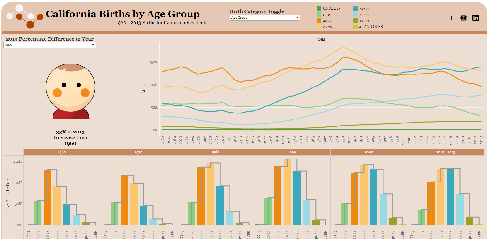

```{r setup, echo=FALSE}
library(rmdformats)
```

\<\<[Go Back](https://koberstudio.com/)



# Summary

I recently read a study showing how the average household size has gone down over the years. I found it really interesting since I have a big family and thought I'd find some data on household size in one of the most populated states in the country, California.

This project is built to show how births in the state of California has gone up and down over the years. We have seen births decrease in the last decade as individuals are having children at later years in life. We analyze and visualize this data using Tableau.

## Github

[View my Project within GitHub](https://github.com/jckober5/california_births)

[{width="200"}](https://github.com/jckober5/ProvoMealTool)

I utilize GitHub as a way to collaborate with others to show them personal projects and host static websites to view these projects. Within this repo you can view the tools, assets, and code used in this project. Some of which include but are not limited to R Scripts, Tableau Workbooks, Image Files, Data Files, etc... Please feel free to take a look at projects I have listed and test them out for yourself!

## Tableau

[View the Tableau Dashboard](https://public.tableau.com/app/profile/joshua.kober/viz/CaliforniaBirthsbyAgeGroup/CaliforniaBirthsbyAgeGroup)

[{width="225"}](https://public.tableau.com/app/profile/joshua.kober6896/viz/ProvoMealToolSurvey/ProvoMealToolSurvey?publish=yes)

Tableau Public is a platform created by Tableau for users to share interactive visualizations with a public community. Tableau has been an area where creativity meets data and being able to communicate/present the data in a way that is appealing to others has always been my goal. Here I published a dashboard to show the results of the data gathered. Please take a look!
