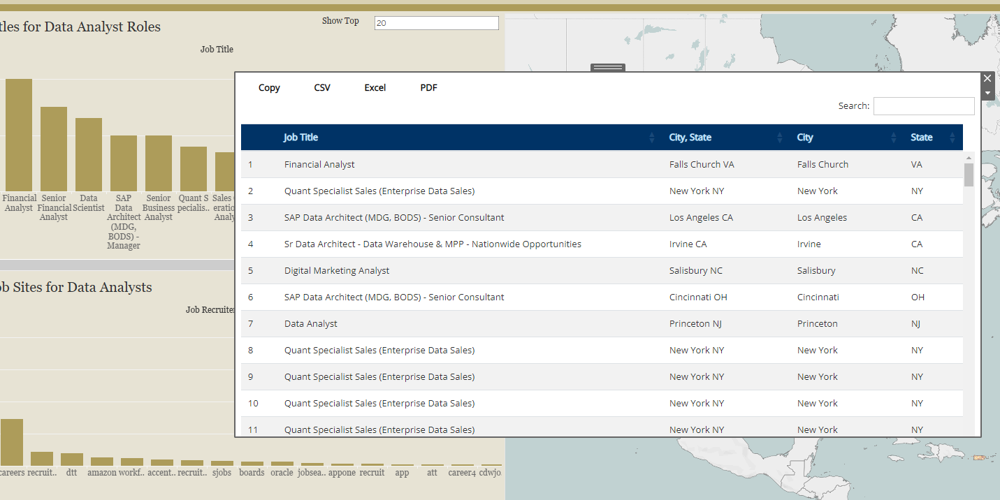

```{r setup, echo=FALSE}
library(rmdformats)
```

\<\<[Go Back](https://.koberstudio.com)



# Summary

Analyzing data in R and Visualizing in Tableau are great, but having them work together can be challenging. Posit has been working on resolving this problem and have a package known as [shinytableau](https://rstudio.github.io/shinytableau/index.html). With this Package we are able to build Tableau Extensions utilizing Shiny Apps built through R. We can utilize and configure R visualizations using Tableau and you can attach your own Shiny Application inside a Tableau Dashboard for added security. Please visit their site to learn more about the potential of this type of development.

In this project we are using ShinyTableau to build a Tableau Extension that uses the datatable visualization. This visualization will provide a specific table for the data provided by Tableau that can be directly viewed, copied, and downloaded in many forms.

We have hosted this application utilizing Shinyapps.io for everyone to use and try for themselves.

## Github

[View my Project within GitHub](https://github.com/jckober5/data_table_extension)

[{width="200"}](https://github.com/jckober5/ProvoMealTool)

I utilize GitHub as a way to collaborate with others to show them personal projects and host static websites to view these projects. Within this repo you can view the tools, assets, and code used in this project. Some of which include but are not limited to R Scripts, Tableau Workbooks, Image Files, Data Files, etc... Please feel free to take a look at projects I have listed and test them out for yourself!

## Shinyapps

[Use the Extension](https://jckober5.shinyapps.io/DataTableExtension/)

[{width="225"}](https://jckober5.shinyapps.io/provoMealTool/)

Shiny is a cloud based platform utilized to host Shiny applications created within R provided by RStudio. Utilization of this platform make deployment of Shiny application easy to deploy, monitor, and scale as this tool grows and changes. The Extension is built within Shinyapp.io and allows for live reporting and the transfer of data from Tableau to the Visualization. I invite you to try this Extension out to discover its capabilities!

In order to use this extension just follow these steps...

1.  Navigate to the shinytableau extension\'s info page and click Download to save a .trex file to your hard drive. (Make sure the URL on the Trex file is pointing to the correct URL of the Tableau Extension hosted page).

2.  In a Tableau dashboard, drag an Extension object from the sidebar to the dashboard.

3.  Select \"My Extensions\", and choose the .trex file you just downloaded. (It\'s now safe to delete that .trex file, or keep it for the next time you want to install that extension.)

4.  Choose \"Configure\" from the down-arrow menu from the border of the extension object. This will provide you the steps in order to build the Data Table needed.
