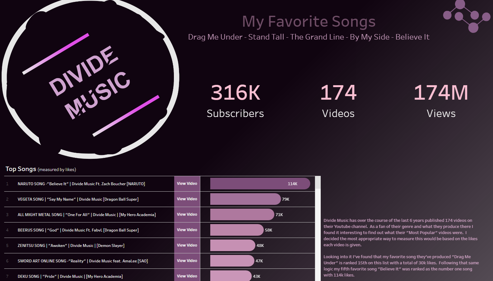

```{r setup, echo=FALSE}
 library(rmdformats)

```

[\<\< Go Back](https://koberstudio.com)



# Summary

Over the past years I have became a huge fan of the artist Divide Music and the music he releases. Some of my favorite songs include [*Drag Me Under*](https://www.youtube.com/watch?v=tnWErAV1Mgs), [*Stand Tall*](https://www.youtube.com/watch?v=urkjKjHrwRs), and [*By My Side*](https://www.youtube.com/watch?v=vsI2248ULi0). I love how he incorporates the feeling and emotion from the movie/show into his song that he backdrops to his created music video on Youtube. I know his channel has been growing over the last years but I wanted to do this project to find out just how much it has been growing.

In this project we aim to answer the following questions...

-   What is the average number of views and likes to expect per video?

-   What are the top songs based on number of likes?

-   How many likes can you expect on your next video based on the number of views?

-   Does the Life of the Channel have a significant effect on the number of views or likes they can expect per day?

To collect and clean the data I utilize Python and the Google API to pull data for the Divide Music channel and each one of their videos. After that I store this data within MYSQL for easy access to visual and statistical software. I then create a view by joining the Channel data to the Video data and create additional fields for help in analysis.

Visualizing this data is done utilizing R on this website and on Tableau. In these visualizations we try to answer the questions mentioned above by performing Descriptive, Diagnostic, Predictive, and Prescriptive analysis. This way we can describe what has happened, why it happened, what might happen in the future, and what possible courses they should take.

# Discover New Music

[Take my Survey](https://jckober5.shinyapps.io/divide_music/)

{width="250"}

Within Shinyapps, I have harnessed the power of interactive technology to craft a survey that aims to introduce you to the amazing world of Divide Music. This survey is designed to delve into your unique musical tastes, allowing me to recommend videos that resonate with you. With Divide Music's extensive catalog, this approach ensures a variety of suggestions to ensure that you'll uncover hidden gems and musical treasures that align perfectly with your preferences. Whether you have heard of Divide Music or just beginning your journey, mysurvey is your gateway to a harmonious discovery of the music that truly speaks to you.

# Predictive Analysis

Here we want to predict the number of views and likes the [Divide Music Youtube Channel](https://www.youtube.com/@DivideMusic) will get on their next video which they typically publish every 2 weeks. By doing this we will run a simple linear regression on how the life of the channel affects the number of views or likes they can expect per day.

## Exploratory Analysis on Views Per Day

Using GGPLOT and PLOTLY we graph the relationship between the Life of the Channel and the average number of views received per day the video has been released. With this graph showing a Upward Linear relationship on the chart, we can feel confident in moving forward with this explanatory variable.

```{r echo=FALSE, warning=FALSE, message=FALSE}
### Read in the Necessary Packages
library(RMySQL)
library(ggplot2)
library(plotly)
library(devtools)
# devtools::install_github('jckober5/R_Package_Remove_Outliers/jkoutliers')
library(jkoutliers)
options(scipen=999)

### Bring in the Data Successfully
#mysqlconnection <- dbConnect(RMySQL::MySQL(),
                            #dbname='external_data',
                            #host='23.239.4.168',
                            #port=3306,
                            #user='jkober',
                            #password='4N4CrFHevPzpdt!')
con <- DBI::dbConnect(RMySQL::MySQL(),
                        host = "23.239.4.168",
                        port = 3306,
                        user = "jkober",
                        password = "4N4CrFHevPzpdt!"
)
df <- DBI::dbGetQuery(con, "select * from external_data.vw_divide_music")


### Perform Exploratory Analysis on potential Relationships on Views
  # How many views can you expect on average per day based on the life of the channel at the time
model.data <- data.frame(views_to_life_ratio = df$views_to_life_ratio
                         , video_created_month = df$video_created_month
                         , video_created_day = df$video_created_day
                         , video_duration_minutes = as.character(round(df$video_duration_minutes, 0))
                         , days_since_last_video = df$days_since_last_video
                         , life_of_channel = round(difftime(df$video_created_date, df$channel_created_date, units = 'days'),0)
              )

ggplotly(ggplot(model.data, aes(x = life_of_channel, y = views_to_life_ratio)) + geom_point(color = 'purple', size = 2) + 
  theme(panel.background = element_rect(fill = "#202123"),
    plot.background = element_rect(fill = "#202123"),
    title = element_text(colour = '#ffffff')) +
  ggtitle("Views per Day based on the Life of the Channel")
)
```

## Cleaning the Views Per Day Data

Within this dataset we can see several outliers occurring. This is due to the video either being out for a long time or not out for long enough. To keep these observations from affecting the model we are going to remove them using a [package](https://koberstudio.com/r_package_remove_outliers/) I developed to clean outliers outside the Interquartile Range (25th and 75th percentile). This will eliminate this percentage of our data...

```{r echo=FALSE, warning=FALSE, message=FALSE}
### Remove outliers affecting data model linearity
model.data.clean <- quantileRemove(model.data, 'views_to_life_ratio')
print(paste0(round(100 - ((nrow(model.data.clean) / nrow(model.data))* 100) ,0), '%'))
```

Our data now looks like so...

```{r echo=FALSE, warning=FALSE, message=FALSE}
ggplotly(ggplot(model.data.clean, aes(x = life_of_channel, y = views_to_life_ratio)) + geom_point(color = 'purple', size = 2) +             
theme(panel.background = element_rect(fill = "#202123"),
plot.background = element_rect(fill = "#202123"),                  title = element_text(colour = '#ffffff')) +            
ggtitle("Views per Day based on the Life of the Channel") )
```

## Creating the Model for Views Per Day

In this model we utilize Linear Regression to try to gauge a prediction. Here we gauge the summary of how the model has done with the data provided so we can properly gauge our prediction on future views.

Within this model we show a P-value below .05 showing that the Life of the Channel is statistically significant when it comes to the expected number of views to be gained per day. We also see an R-squared and Adjusted R-squared value around .49 which proves a mid level correlation on the model, but 51% of the variability isn't explained within the model. I believe as more videos are released this model will begin to have a better fit.

```{r echo=FALSE, warning=FALSE, message=FALSE}
### Run Linear Regression model to discover significance and impact of the Channel life on expected views per day
model <- lm(views_to_life_ratio ~ life_of_channel, data = model.data.clean)
print(summary(model))
```

## Predicition on Views Per Day for the Next Video

Finally, now that our model is created, we can run a prediction to determine the number of average views to be expected for the next video Divide Music Launches. The next video is typically launched every 2 weeks on Friday and that is what my prediction is based on.

The expected number of views per day is...

```{r echo=FALSE, warning=FALSE, message=FALSE}
### What is the expected number of views to count on per day for their next video that will be published in 14 days
new_data <- data.frame(life_of_channel = max(model.data$life_of_channel) + 14)
print(round(predict(model, new_data),1))
```

## Exploratory Analysis on Likes Per Day

Using GGPLOT and PLOTLY we graph the relationship between the Life of the Channel and the average number of likes received per day the video has been released. With this graph showing a Upward Linear relationship on the chart, we can feel confident in moving forward with this explanatory variable.

```{r echo=FALSE, warning=FALSE, message=FALSE}
### Perform Exploratory Analysis on potential Relationships on Likes
  # How many likes can you expect on average per day based on the life of the channel at the time
model.data <- data.frame(likes_to_life_ration = df$likes_to_life_ration
                         , video_created_month = df$video_created_month
                         , video_created_day = df$video_created_day
                         , video_duration_minutes = as.character(round(df$video_duration_minutes, 0))
                         , days_since_last_video = df$days_since_last_video
                         , life_of_channel = round(difftime(df$video_created_date, df$channel_created_date, units = 'days'),0)
)

ggplotly(ggplot(model.data, aes(x = life_of_channel, y = likes_to_life_ration)) + geom_point(color = 'purple', size = 2) + 
           theme(panel.background = element_rect(fill = "#202123"),
                 plot.background = element_rect(fill = "#202123"),
                 title = element_text(colour = '#ffffff')) +
           ggtitle("Likes per Day based on the Life of the Channel")
)
```

## Cleaning the Likes Per Day Data

Within this dataset we can see several outliers occurring. This is due to the video either being out for a long time or not out for long enough. To keep these observations from affecting the model we are going to remove them using a [package](https://koberstudio.com/r_package_remove_outliers/) I developed to clean outliers outside the Interquartile Range (25th and 75th percentile). This will eliminate this percentage of our data...

```{r echo=FALSE, warning=FALSE, message=FALSE}

### Remove outliers affecting data model linearity
model.data.clean <- quantileRemove(model.data, 'likes_to_life_ration')
print(paste0(round(100 - ((nrow(model.data.clean) / nrow(model.data))* 100) ,0), '%'))
```

Our data now looks like so...

```{r echo=FALSE, warning=FALSE, message=FALSE}
ggplotly(ggplot(model.data.clean, aes(x = life_of_channel, y = likes_to_life_ration)) + geom_point(color = 'purple', size = 2) + 
           theme(panel.background = element_rect(fill = "#202123"),
                 plot.background = element_rect(fill = "#202123"),
                 title = element_text(colour = '#ffffff')) +
           ggtitle("Likes per Day based on the Life of the Channel")
)
```

## Creating the Model for Likes Per Day

In this model we utilize Linear Regression to try to gauge a prediction. Here we gauge the summary of how the model has done with the data provided so we can properly gauge our prediction on future likes.

Within this model we show a P-value below .05 showing that the Life of the Channel is statistically significant when it comes to the expected number of likes to be gained per day. We also see an R-squared and Adjusted R-squared value around .65 which proves a high level correlation on the model, but 35% of the variability isn't explained within the model. This is better model than the one for Views Per Day.

```{r echo=FALSE, warning=FALSE, message=FALSE}
### Run Linear Regression model to discover significance and impact of the Channel life on expected likes per day
model <- lm(likes_to_life_ration ~ life_of_channel, data = model.data.clean)
print(summary(model))
```

## Predicition on Likes Per Day for the Next Video

Finally, now that our model is created, we can run a prediction to determine the number of average likes to be expected for the next video Divide Music Launches. The next video is typically launched every 2 weeks on Friday and that is what my prediction is based on.

The expected number of likes per day is...

```{r echo=FALSE, warning=FALSE, message=FALSE}
### What is the expected number of likes to count on per day for their next video that will be published in 14 days
new_data <- data.frame(life_of_channel = max(model.data$life_of_channel) + 14)
print(round(predict(model, new_data),1))
```

## Conclusion

Here we were able to predict the number of views and likes the Divide Music Youtube Channel will get on average per day on their next video which they typically publish every 2 weeks. To do this we ran two linear regression models and utilized the Life of the Channel as our Explanatory Variable to determine those predictions above.

This variable proved significant in both models and the model had mid to high level fit within out data's variability. I am so excited to have utilized this data to show how much this channel has grown over the years. Their content has improved drastically and I look forward to their videos almost every 2 weeks. I invite you to check out their content as well on [Youtube](https://www.youtube.com/@DivideMusic).

# Explore Divide Music Visually

## Tableau

[View the Tableau Dashboard](https://public.tableau.com/app/profile/joshua.kober6896/viz/DivideMusic/DivideMusic)

{width="225"}

Tableau Public is a platform created by Tableau for users to share interactive visualizations with a public community. Tableau has been an area where creativity meets data and being able to communicate/present the data in a way that is appealing to others has always been my goal. Here I published a dashboard as a tool to help others find specific information pertinent to this project. Please take a look!

## Metabase

[View the Metabase Dashboard](http://kobernetwork.com:3000/public/dashboard/44df7a12-d3b7-4179-acc8-513aba47cfaf)

{width="225"}

Metabase is an open-source business intelligence and data visualization tool that allows users to easily create interactive dashboards and analyze data without the need for extensive technical expertise. It provides a user-friendly interface for querying databases, exploring datasets, and generating visualizations such as charts and graphs. Metabase supports various data sources, including SQL databases, NoSQL databases, and cloud-based data warehouses. Its goal is to democratize data access within organizations, enabling non-technical users to make informed decisions based on data insights. Metabase is designed to be easy to install, configure, and use, making it a popular choice for organizations seeking a simple yet powerful business intelligence solution.

# Project Repo

## Github

[View my Project within GitHub](https://github.com/jckober5/divide_music)

{width="200"}

I utilize GitHub as a way to collaborate with others to show them personal projects and host static websites to view these projects. Within this repo you can view the tools, assets, and code used in this project. Some of which include but are not limited to R Scripts, Tableau Workbooks, Image Files, Data Files, etc... Please feel free to take a look at projects I have listed and test them out for yourself!
