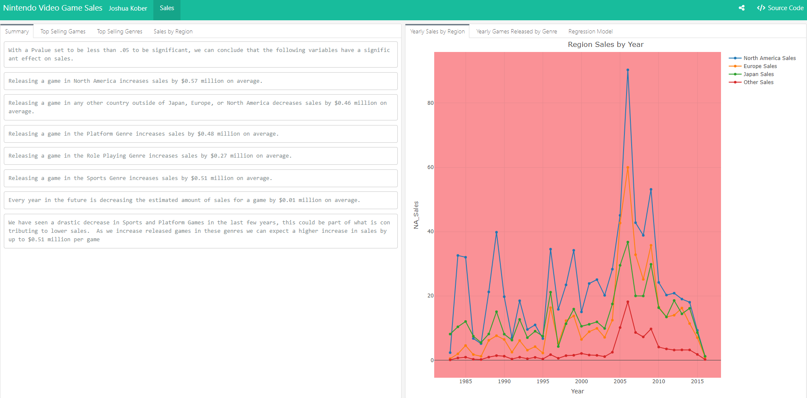

```{r setup, echo=FALSE}
library(rmdformats)
```

\<\<[Go Back](https://koberstudio.com)



# Summary

Growing up in the 1990's and 2000's my brother and I were always playing on our Nintendo platform, whether it was the Nintendo 64 all the way to the Nintendo Switch. We enjoyed playing games like Zelda, Mario, and Pokemon. In this data I wanted to analyze the top grossing games and genres for this platform.

I analyzed this data and found it on Kaggle where we got stock data for sales per region, game, and genre. I run a Regression model and utilize visualizations with GGPlot and Plotly on an RMarkdown format.

## Github

[View my Project within GitHub](https://github.com/jckober5/nintendo_sales)

[{width="200"}](https://github.com/jckober5/ProvoMealTool)

I utilize GitHub as a way to collaborate with others to show them personal projects and host static websites to view these projects. Within this repo you can view the tools, assets, and code used in this project. Some of which include but are not limited to R Scripts, Tableau Workbooks, Image Files, Data Files, etc... Please feel free to take a look at projects I have listed and test them out for yourself!

## Tableau

[View the Tableau Dashboard](https://public.tableau.com/app/profile/joshua.kober6896/viz/NintendoSales_16934514022350/NintendoSales)

[{width="225"}](https://public.tableau.com/app/profile/joshua.kober6896/viz/ProvoMealToolSurvey/ProvoMealToolSurvey?publish=yes)

Tableau Public is a platform created by Tableau for users to share interactive visualizations with a public community. Tableau has been an area where creativity meets data and being able to communicate/present the data in a way that is appealing to others has always been my goal. Here I published a dashboard to show the results of the data. Please take a look!
