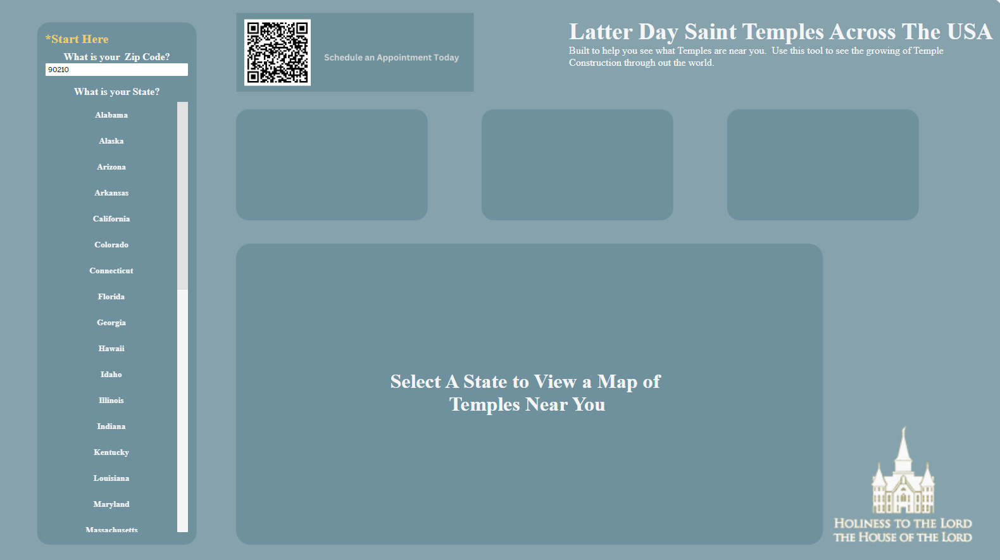

```{r setup, echo=FALSE}
library(rmdformats)
```



# Summary

This project was done to help view the progress of Temples across the United States for the Church of Jesus Christ of Latter Day Saints. New Temples are announced every six months to be built, so I wanted to create a way to scrape this data from <https://churchofjesuschristtemples.org/maps/> to update a visual to show all those Temples that have been built and will be built. I wanted to create a process in which this can be be done quickly and easily.

To scrape this data into a csv we utilized a Python script within Jupyter Notebook. After that we read and stored the data into a MYSQL Database. This way we have it stored in two separate locations (Github and MYSQL).

Afterwards, we took the data and created a visualization within Tableau that not only shows you the Temples that are currently announced, but has the functionality to show you all the Temples near your inputted Zip Code. By inputting you Zip Code and selecting the State, you can visualize statistics on Temples within that area and view a map of all Temples in the State selected.

## Github

[View my Project within GitHub](https://github.com/jckober5/temples)

[{width="200"}](https://github.com/jckober5/temples)

I utilize GitHub as a way to collaborate with others to show them personal projects and host static websites to view these projects. Within this repo you can view the tools, assets, and code used in this project. Some of which include but are not limited to R Scripts, Tableau Workbooks, Image Files, Data Files, etc... Please feel free to take a look at projects I have listed and test them out for yourself!

## Tableau

[View the Tableau Dashboard](https://public.tableau.com/app/profile/joshua.kober6896/viz/LatterDaySaintTemplesAcrosstheUSA/TemplesAcrosstheUSA)

[{width="225"}](https://public.tableau.com/app/profile/joshua.kober6896/viz/LatterDaySaintTemplesAcrosstheUSA/TemplesAcrosstheUSA)

Tableau Public is a platform created by Tableau for users to share interactive visualizations with a public community. Tableau has been an area where creativity meets data and being able to communicate/present the data in a way that is appealing to others has always been my goal. Here I published a dashboard as a tool to help others find a Latter Day Saint's Temple near them, while also providing basic statistics on that Temple. Please take a look!
